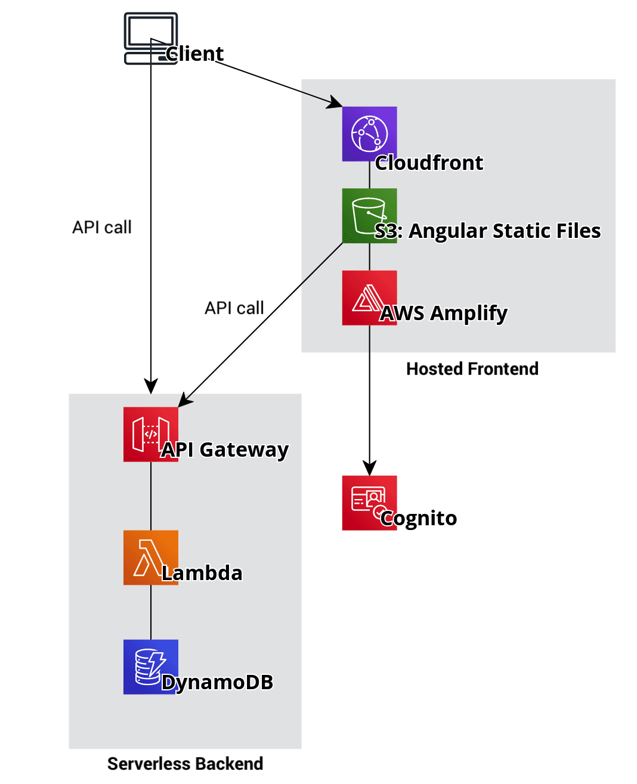

# Serverless posts application

### AWS Architecture
Social media-like Angular application with a fully serverless CRUD backend hosted on AWS. Uses API Gateway, AWS Lambda to manage resources in a DynamoDB table.

Serverless backend was built with [serverless framework](https://github.com/serverless/serverless) for quickly setting up lambda functions, API endpoints and deployment.

Authentification component via [AWS Amplify](https://github.com/aws-amplify/amplify-js), used for managing user pools in AWS Cognito.

Current AWS Cloudfront URL: https://d1gna7c44pmpfw.cloudfront.net
